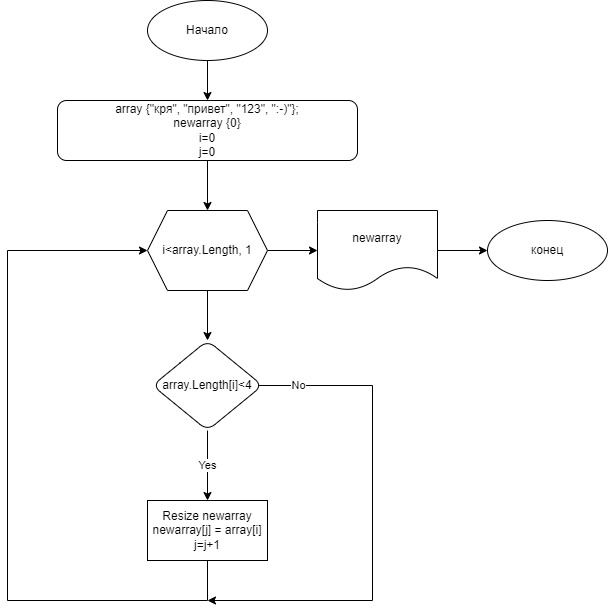

# Выбор специализации
1. Прописываем заданный массив в коде
2. Задаем новый пустой массив
3. Прописываем цикл for со счетчиком i, в теле цикла задаем счетчик j и задаем условие длина элемента < 4, если условие выполняется сохраняем данный элемент первого массива в новом массиве
4. Выводим новый массив на экран
5. Блок-схема 
